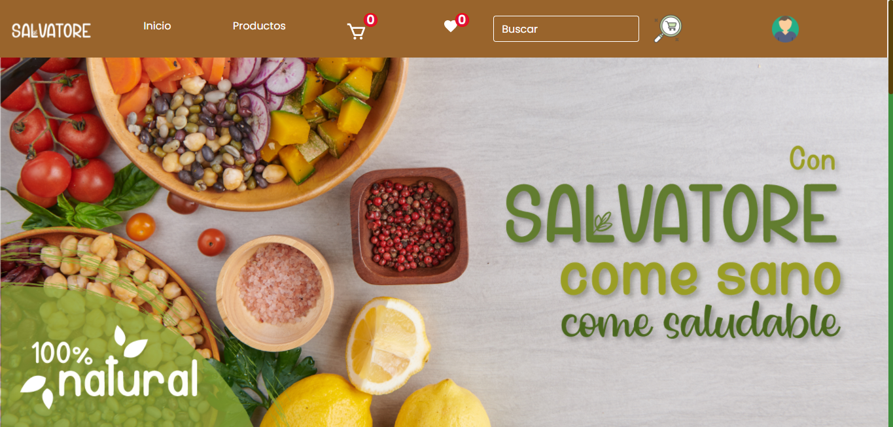
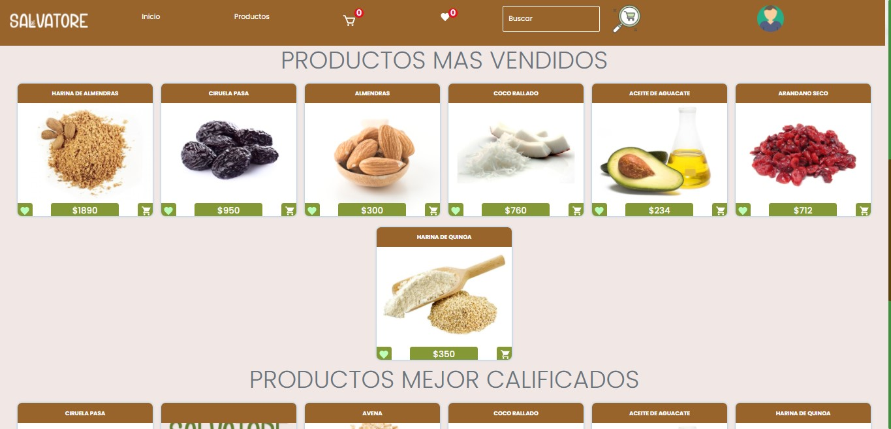

    

# Proyecto Grupal - Ecomerce Dietetica

  

## Objetivos

En este proyecto se busca construir una aplicacion de recetas de cocina con las siguientes tecnologias:
-    React & redux para el frontend
-    Node js & express para el backend (node -v >= 12.18.3)
-    Postgres Sql Como base de datos relacional

## Como iniciar
1. Clonar el repositorio en su computadora
2. Tener nodejs (version = 14.15.4), npm (version >= 6.14.16)
3. una vez posicionado en la carpeta del repositorio hacer `npm i` desde la carpeta **/Back** y `npm i` desde la carpeta **/Front**
4. Crear una base de datos de postgres local o en la nube, si no sabe como hacerlo puede consultar el siguiente link: [crear base de datos](http://postgresql-dbms.blogspot.com/p/crear-una-base-de-datos-en-postgres-sql.html)
5. Crear un archivo .env en la carpeta /Back, este archivo sirve para determinar las variables de entorno que seran utilizadas al inciar el proyecto,
debe tener los siguientes valores contenidos en el:
~~~
DB_USER=
DB_PASSWORD=
DB_HOST=
DB_NAME=
PORT=3001
~~~
donde ``DB_USER`` es el usuario de su base de datos, ``DB_PASSWORD`` es la password de su base de datos, ``DB_HOST`` es el host de su base de datos,
``PORT`` es el puerto donde se inicializa el backend del proyecto; si ya tiene este puerto ocupado puede utilizar otro

6. Luego que se hayan instalado todas las librerias con el paso anterior desde la carpeta **/Front** ejecutar el comando `npm run dev` para inciar el backend del proyecto, igualmente hacer ``npm start`` en /Front  para iniciarlo
7. luego de esto, abrir el navegador en http://localhost:3000 en el navegador

## Resultados 
### **Sí ha completado los pasos exitosamente en su navegador deberia visualizar una aplicacion como esta:**

  

### **Y si baja un poco encontrara los productos mas vendidos y mejor calificados que se vera algo asi:**

  

### **Llegado a este punto ya podra visualizar los productos, filtrar por nombre, dietas, categorias entre otros, y hacer las acciones tipicas en una pagina de ecomerce**

### **Si desea visualizar el proyecto ya deployado en una pagina dirigirse a el siguiente link: [ecommerce-dietetica](https://ecommerce-dietetica.vercel.app/)**
